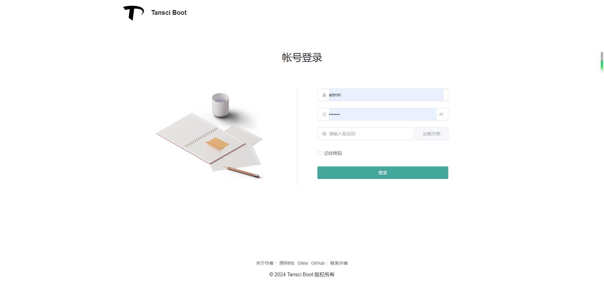
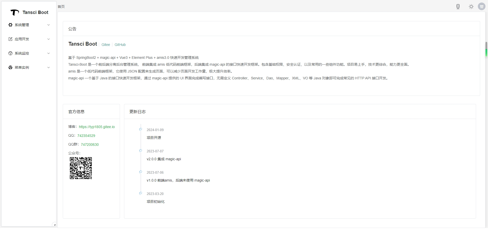
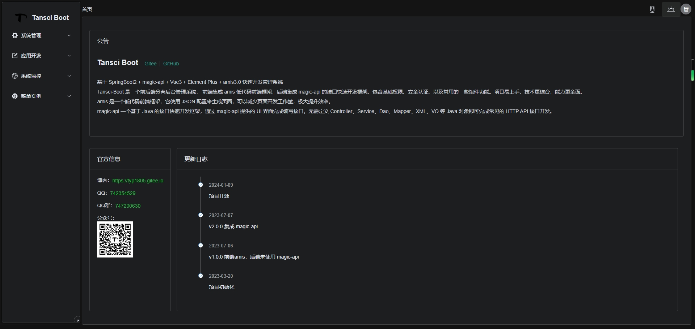

# Tansci-Boot

<p align="center">
<a href="https://www.oracle.com/java/technologies/downloads/#java8"></a>
<a href="https://www.ssssssss.org/magic-api"></a>
<a href="https://vuejs.org"></a>
<a href="https://element-plus.gitee.io/#/zh-CN/component/changelog"></a>
<a href="https://aisuda.bce.baidu.com/amis/zh-CN/docs/index"></a>
<a href="https://gitee.com/link?target=http%3A%2F%2Fwww.opensource.org%2Flicenses%2FMIT"></a>
</p>

<p align="center">基于 SpringBoot3 + magic-api + Vue3 + Element Plus + amis3.0 快速开发管理系统</p>

Tansci-Boot 是一个前后端分离后台管理系统， 前端集成 `amis` 低代码前端框架，后端集成 `magic-api` 的接口快速开发框架。包含基础权限、安全认证、以及常用的一些组件功能。项目易上手，技术更综合，能力更全面。

[amis](https://aisuda.bce.baidu.com/amis/zh-CN/docs/index) 是一个低代码前端框架，它使用 `JSON` 配置来生成页面，可以减少页面开发工作量，极大提升效率。

[magic-api](https://www.ssssssss.org/magic-api/) 一个基于 `Java` 的接口快速开发框架，通过 `magic-api` 提供的 `UI` 界面完成编写接口，无需定义 `Controller`、`Service`、`Dao`、`Mapper`、`XML`、`VO` 等 `Java` 对象即可完成常见的 `HTTP API` 接口开发。

全面的技术运用：

- 解决前后端分离难题：前后端功能整合，集成 HTTP 组件 Axios，解决前后端分离架构中常见的问题，如跨域、参数传递、多环境配置等；
- 落地实践工程化项目：涵盖日志、配置文件、部署、Git、Maven，后端接口统一返回参数设计、封装统一请求返回参数、工具类封装；
- amis：低代码前端配置框架； 
- magic-api：HTTP API 接口快速开发框架。

版本说明：

- master 分支为最新版本
- boot2 分支为 SpringBoot2 版本

## 项目预览

 | 
---|---

 | 
---|---

 | 
---|---

 | 
---|---

 | 
---|---

## 开始使用

执行 SQL 初始化数据（MySQL8+ 版本），测试用户：`admin/123456`，API 管理界面登录用户：`admin/admin@123` (可在配置文件修改)。

**项目目录：**

- tansci-boot：后端项目
- tansci-boot-ui：前端项目
- tansci-boot-ui-editor：amis 低代码编辑器
- sql：数据库 SQL 脚本

**amis 配置说明：**

在 ``tansci-boot-ui/public/gh-pages/config.js`` 可配置编辑器获取页面JSON和保存接口的配置。

> 注意：在页面编辑器中业务接口回报404可忽略。

**接口开发配置：**

接口开发菜单页面加载不了，检查环境变量配置的服务地址是否和后端服务一致：``tansci-boot-ui/.env.development`` 参数 `VITE_BASE_API`

**项目地址：**

Gitee: [https://gitee.com/typ1805/tansci-boot](https://gitee.com/typ1805/tansci-boot)

GitHub: [https://github.com/typ1805/tansci-boot](https://github.com/typ1805/tansci-boot)

## 打包部署

**editor 打包**

配置编辑器获取页面和保存JSON数据的接口，以及TOKEN前缀在 `tansci-boot-ui-editor/public/config.js` 目录下，也可以在打包后的 `tansci-boot-ui-editor/gh-pages/config.js` 目录文件中修改。

```shell
npm run build
```

打包后的文件在 `tansci-boot-ui-editor/gh-pages` 目录下。

**前端打包**
```shell
npm run build
```

打包前将 `tansci-boot-ui-editor/gh-pages` 目录下编译后的编辑器包复制到 `tansci-boot-ui/public` 目录下，再打前端包。

**后端打包**

```shell
mvn clean package
```

jar 包启动前先初始化数据库，接口都存储在 `magic_api_file` 表中。

## 开发者联系

- QQ：742354529 （微信群）
- QQ 群： 747200630
- 个人主站：[http://tansci.top](http://tansci.top)
- 公众号：
  
